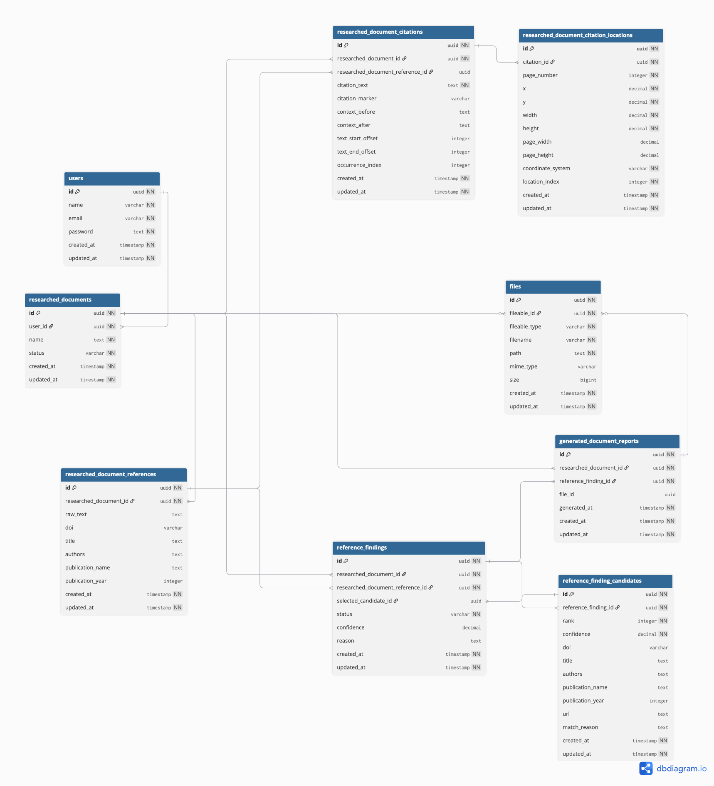

# Database Schema



```dbml
Table users {

  id uuid [pk, not null]

  name varchar [not null]

  email varchar [not null]

  password text [not null]

  created_at timestamp [not null]

  updated_at timestamp [not null]

}


Table files {

  id uuid [pk, not null]

  fileable_id uuid [not null]

  fileable_type varchar [not null]

  filename varchar [not null]

  path text [not null]

  mime_type varchar

  size bigint

  created_at timestamp [not null]

  updated_at timestamp [not null]

  indexes {

    (fileable_type, fileable_id)

  }

}


Table researched_documents {

  id uuid [pk, not null]

  user_id uuid [not null]

  name text [not null]

  status varchar [not null, default: 'pending']

  // Analysis progress tracking.
  // progress: 0-100. step: current pipeline step. error: failure message.
  analysis_progress integer [not null, default: 0]

  analysis_step varchar

  analysis_error text

  analysis_started_at timestamp

  analysis_completed_at timestamp

  created_at timestamp [not null]

  updated_at timestamp [not null]

}


Table researched_document_references {

  id uuid [pk, not null]

  researched_document_id uuid [not null]

  raw_text text

  doi varchar

  title text

  authors text

  publication_name text

  publication_year integer

  // Character offsets of this entry within the extracted page text.
  text_start_offset integer

  text_end_offset integer

  created_at timestamp [not null]

  updated_at timestamp [not null]

  indexes {

    researched_document_id

    doi

  }

}


// One reference can have multiple locations.
// Useful when a reference entry spans multiple lines or pages.

Table researched_document_reference_locations {

  id uuid [pk, not null]

  researched_document_reference_id uuid [not null]

  // 1-based PDF page number
  page_number integer [not null]

  // Bounding box in PDF page coordinates.
  x decimal [not null]

  y decimal [not null]

  width decimal [not null]

  height decimal [not null]

  // Optional page dimensions.
  page_width decimal

  page_height decimal

  // Coordinate system used by the stored values.
  coordinate_system varchar [not null, default: 'pdf_points_top_left']

  // Order when a reference spans multiple regions.
  location_index integer [not null, default: 0]

  created_at timestamp [not null]

  updated_at timestamp [not null]

  indexes {

    (researched_document_reference_id, location_index) [unique]

    page_number

  }

}


// One row = one citation occurrence in the PDF.
// Example: reference [3] appears five times -> five citation rows.

Table researched_document_citations {

  id uuid [pk, not null]

  researched_document_id uuid [not null]

  // Reference entry this citation points to.
  // Nullable because a citation may be unresolved.
  researched_document_reference_id uuid

  // Citation as it appears in the PDF.
  // Examples: "[3]", "(Smith, 2020)", "Smith et al. (2020)"
  citation_text text [not null]

  // Optional normalized marker.
  // Examples: "[3]", "Smith, 2020"
  citation_marker varchar

  // Optional surrounding text.
  // Useful for locating or validating the citation again.
  context_before text

  context_after text

  // Optional character offsets within the extracted page text.
  text_start_offset integer

  text_end_offset integer

  // Order of this citation occurrence within the document.
  occurrence_index integer

  created_at timestamp [not null]

  updated_at timestamp [not null]

  indexes {

    researched_document_id

    researched_document_reference_id

    (researched_document_id, occurrence_index) [unique]

  }

}


// One citation can have multiple locations.
// Useful when a citation spans multiple lines or text fragments.

Table researched_document_citation_locations {

  id uuid [pk, not null]

  citation_id uuid [not null]

  // 1-based PDF page number
  page_number integer [not null]

  // Bounding box in PDF page coordinates.
  // Usually measured from the top-left or bottom-left origin.
  x decimal [not null]

  y decimal [not null]

  width decimal [not null]

  height decimal [not null]

  // Optional page dimensions.
  // Useful for coordinate conversion in the PDF viewer.
  page_width decimal

  page_height decimal

  // Coordinate system used by the stored values.
  // Example: "pdf_points_top_left"
  coordinate_system varchar [not null, default: 'pdf_points_top_left']

  // Order when a citation spans multiple regions.
  location_index integer [not null, default: 0]

  created_at timestamp [not null]

  updated_at timestamp [not null]

  indexes {

    (citation_id, location_index) [unique]

    page_number

  }

}


Table reference_findings {

  id uuid [pk, not null]

  researched_document_id uuid [not null]

  researched_document_reference_id uuid [not null]

  // Candidate selected as the best match
  selected_candidate_id uuid

  status varchar [not null]

  // pending, valid, suspicious, invalid, not_found
  confidence decimal

  reason text

  // Manual review audit.
  reviewed_by uuid

  reviewed_at timestamp

  is_manual boolean [not null, default: false]

  created_at timestamp [not null]

  updated_at timestamp [not null]

  indexes {

    researched_document_id

    researched_document_reference_id

  }

}


Table reference_finding_candidates {

  id uuid [pk, not null]

  reference_finding_id uuid [not null]

  // Ranking returned by the matching algorithm
  rank integer [not null]

  confidence decimal [not null]

  // Candidate publication
  doi varchar

  title text

  authors text

  publication_name text

  publication_year integer

  url text

  // Why this candidate was considered a match
  match_reason text

  created_at timestamp [not null]

  updated_at timestamp [not null]

  indexes {

    (reference_finding_id, rank) [unique]

  }

}


Table generated_document_reports {

  id uuid [pk, not null]

  researched_document_id uuid [not null]

  // Nullable because reports are generated at document level.
  reference_finding_id uuid

  file_id uuid

  status varchar [not null, default: 'pending']

  // pending, processing, completed, failed
  error text

  // Set when generation completes.
  generated_at timestamp

  created_at timestamp [not null]

  updated_at timestamp [not null]

}


// Relationships

Ref: researched_documents.user_id > users.id

Ref: researched_document_references.researched_document_id > researched_documents.id

Ref: researched_document_reference_locations.researched_document_reference_id > researched_document_references.id

Ref: researched_document_citations.researched_document_id > researched_documents.id

Ref: researched_document_citations.researched_document_reference_id > researched_document_references.id

Ref: researched_document_citation_locations.citation_id > researched_document_citations.id

Ref: reference_findings.researched_document_id > researched_documents.id

Ref: reference_findings.researched_document_reference_id > researched_document_references.id

Ref: reference_findings.reviewed_by > users.id

Ref: reference_findings.selected_candidate_id > reference_finding_candidates.id

Ref: reference_finding_candidates.reference_finding_id > reference_findings.id

Ref: generated_document_reports.researched_document_id > researched_documents.id

Ref: generated_document_reports.reference_finding_id > reference_findings.id

Ref: "generated_document_reports"."id" <? "files"."fileable_id"

Ref: "researched_documents"."id" <? "files"."fileable_id"
```

lmao
```dbml
Table users {

  id uuid [pk, not null]

  name varchar [not null]

  email varchar [not null]

  password text [not null]

  created_at timestamp [not null]

  updated_at timestamp [not null]

}


Table files {

  id uuid [pk, not null]

  fileable_id uuid [not null]

  fileable_type varchar [not null]

  filename varchar [not null]

  path text [not null]

  mime_type varchar

  size bigint

  created_at timestamp [not null]

  updated_at timestamp [not null]

  indexes {

    (fileable_type, fileable_id)

  }

}


Table researched_documents {

  id uuid [pk, not null]

  user_id uuid [not null]

  name text [not null]

  status varchar [not null, default: 'pending']

  created_at timestamp [not null]

  updated_at timestamp [not null]

}


Table researched_document_references {

  id uuid [pk, not null]

  researched_document_id uuid [not null]

  raw_text text

  doi varchar

  title text

  authors text

  publication_name text

  publication_year integer

  created_at timestamp [not null]

  updated_at timestamp [not null]

  indexes {

    researched_document_id

    doi

  }

}


// One row = one citation occurrence in the PDF.
// Example: reference [3] appears five times -> five citation rows.

Table researched_document_citations {

  id uuid [pk, not null]

  researched_document_id uuid [not null]

  // Reference entry this citation points to.
  // Nullable because a citation may be unresolved.
  researched_document_reference_id uuid

  // Citation as it appears in the PDF.
  // Examples: "[3]", "(Smith, 2020)", "Smith et al. (2020)"
  citation_text text [not null]

  // Optional normalized marker.
  // Examples: "[3]", "Smith, 2020"
  citation_marker varchar

  // Optional surrounding text.
  // Useful for locating or validating the citation again.
  context_before text

  context_after text

  // Optional character offsets within the extracted page text.
  text_start_offset integer

  text_end_offset integer

  // Order of this citation occurrence within the document.
  occurrence_index integer

  created_at timestamp [not null]

  updated_at timestamp [not null]

  indexes {

    researched_document_id

    researched_document_reference_id

    (researched_document_id, occurrence_index) [unique]

  }

}


// One citation can have multiple locations.
// Useful when a citation spans multiple lines or text fragments.

Table researched_document_citation_locations {

  id uuid [pk, not null]

  citation_id uuid [not null]

  // 1-based PDF page number
  page_number integer [not null]

  // Bounding box in PDF page coordinates.
  // Usually measured from the top-left or bottom-left origin.
  x decimal [not null]

  y decimal [not null]

  width decimal [not null]

  height decimal [not null]

  // Optional page dimensions.
  // Useful for coordinate conversion in the PDF viewer.
  page_width decimal

  page_height decimal

  // Coordinate system used by the stored values.
  // Example: "pdf_points_top_left"
  coordinate_system varchar [not null, default: 'pdf_points_top_left']

  // Order when a citation spans multiple regions.
  location_index integer [not null, default: 0]

  created_at timestamp [not null]

  updated_at timestamp [not null]

  indexes {

    (citation_id, location_index) [unique]

    page_number

  }

}


Table reference_findings {

  id uuid [pk, not null]

  researched_document_id uuid [not null]

  researched_document_reference_id uuid [not null]

  // Candidate selected as the best match
  selected_candidate_id uuid

  status varchar [not null]

  // pending, valid, suspicious, invalid, not_found
  confidence decimal

  reason text

  created_at timestamp [not null]

  updated_at timestamp [not null]

  indexes {

    researched_document_id

    researched_document_reference_id

  }

}


Table reference_finding_candidates {

  id uuid [pk, not null]

  reference_finding_id uuid [not null]

  // Ranking returned by the matching algorithm
  rank integer [not null]

  confidence decimal [not null]

  // Candidate publication
  doi varchar

  title text

  authors text

  publication_name text

  publication_year integer

  url text

  // Why this candidate was considered a match
  match_reason text

  created_at timestamp [not null]

  updated_at timestamp [not null]

  indexes {

    (reference_finding_id, rank) [unique]

  }

}


Table generated_document_reports {

  id uuid [pk, not null]

  researched_document_id uuid [not null]

  reference_finding_id uuid [not null]

  file_id uuid

  generated_at timestamp [not null]

  created_at timestamp [not null]

  updated_at timestamp [not null]

}


// Relationships

Ref: researched_documents.user_id > users.id

Ref: researched_document_references.researched_document_id > researched_documents.id

Ref: researched_document_citations.researched_document_id > researched_documents.id

Ref: researched_document_citations.researched_document_reference_id > researched_document_references.id

Ref: researched_document_citation_locations.citation_id > researched_document_citations.id

Ref: reference_findings.researched_document_id > researched_documents.id

Ref: reference_findings.researched_document_reference_id > researched_document_references.id

Ref: reference_findings.selected_candidate_id > reference_finding_candidates.id

Ref: reference_finding_candidates.reference_finding_id > reference_findings.id

Ref: generated_document_reports.researched_document_id > researched_documents.id

Ref: generated_document_reports.reference_finding_id > reference_findings.id

Ref: "generated_document_reports"."id" <? "files"."fileable_id"

Ref: "researched_documents"."id" <? "files"."fileable_id"
```

